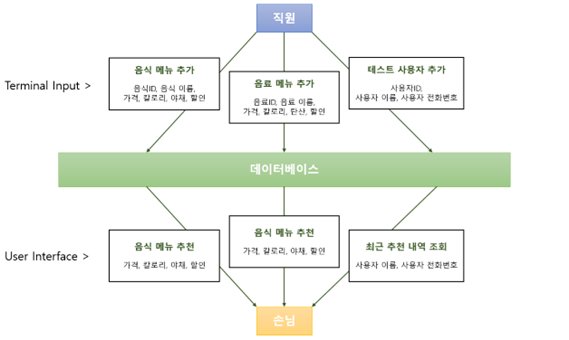
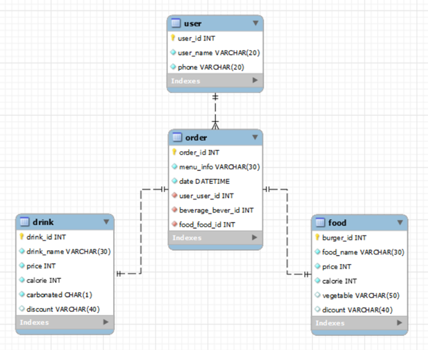

# 
 Fast-Food Restaurant Menu Recommendation System 

    

### Contents
1. [Overview](#overview)
2. [Requirements](#requirements)
3. [Languages and Development Tools](#languages-and-development-tools)
4. [Issue](#issue)
5. [Architecture](#architecture)
6. [Repository Explaination](#repository-explaination)
7. [Result](#result)
8. [Conclusion](#conclusion)
9. [Reference](#reference)
10. [Developer](#developer)

### Overview
The goal of this project is to make more use of the advantages of fast food by shortening the time to choose menus at fast food restaurants where people flock by recommending menus through an accessible interface amid the craze of fast food restaurants.

This system is for administrators who manage large amounts of data, such as adding and changing data, and users who are recommended menus using recommended systems. The system administrator updates new menus, discount information and etc for each menu through the server interface. In addition, system users are recommended menus by inputting price conditions, calorie conditions, hamburger vegetables, beverage carbonation status, and discount information conditions into the user interface.

In this case, the system administrator can manage the system through the Shell, and the system user can use the system through a simplified interface that anyone can easily access. However, although it is an easy-to-access interface at this stage, it is a minimal interface created using the python tkinter library, so there are plans to further develop the frontend interface.

 

The requirements satisfied by this program are as follows. 
+ Information on hamburgers and beverages desired by the user is input.
+ Hamburgers and drinks are recommended accordingly based on the information entered by the user.
+ The information on the menu that the user input includes a price range, a range of calories, the presence or absence of carbonated drinks and vegetables, and discount information.
+ Order details can be stored and inquired for each user .
+ It implements a simplified user interface so that even users who have not been exposed to many digital devices can easily access and use it.
  
   
  
간소화된 인터페이스로부터 고객의 조건을 만족하는 메뉴 추천을 해줌으로써 사람들이 몰리는 패스트푸드점의 메뉴 선택 시간을 하여 패스트푸드의 장점을 보다 더 살릴 수 있는 것이 본 프로젝트의 목표이다. 시스템은 크게 데이터를 추가하고 변경하는 등의 관리를 하는 시스템 관리자와 추천시스템을 사용하여 메뉴를 추천받는 시스템 사용자를 위한 시스템이다. 시스템 관리자는 햄버거와 음료의 신메뉴와 수정된 메뉴별 할인정보 등을 서버 인터페이스를 통해 업데이트할 수 있다. 또한, 시스템 사용자는 가격 조건, 칼로리 조건, 햄버거 야채 포함 및 음료 탄산 여부, 할인 정보 조건을 사용자 인터페이스에 입력하여 해당 조건에 맞는 메뉴를 추천받는다. 이 때, 시스템 관리자는 Shell을 통하여, 시스템 사용자는 누구나 쉽게 접근이 가능한 간소화된 인터페이스를 통해 시스템을 관리 및 사용할 수 있다. 하지만 현재 단계에서 누구나 접근하기 쉬운 인터페이스는 맞으나, python tkinter library를 이용하여 만든 최소한의 인터페이스이기 때문에, frontend 인터페이스를 더 발전시킬 계획이 있다.
  
프로젝트의 요구사항은 다음과 같다. 

+ 사용자가 원하는 햄버거 및 음료의 정보를 입력 받는다.
+ 사용자가 입력한 정보를 바탕으로 그에 맞는 햄버거와 음료를 추천해준다.
+ 사용자가 입력할 수 있는 메뉴의 정보에는 가격 범위, 칼로리의 범위, 탄산 및 채소의 유무, + 할인 정보 등이 포함된다.
+ 사용자마다의 주문 내역을 저장하고, 이를 조회할 수 있다.
ㅍ새로운 메뉴가 업데이트되면 해당 메뉴를 추가할 수 있다.
+ 메뉴의 정보가 바뀌면 해당 메뉴의 정보를 업데이트할 수 있다.
+ 디지털 장비를 많이 접해보지 못한 사용자도 쉽게 접근하고 사용할 수 있도록 간소화된 User Interface를 구현한다.

### Requirements
+ Python 3.6

### Languages and Development Tools
     

### Architecture
[📑 Here is Detailed Project Description]()

   

   

### Repository Explaination
###### 📄 backend.sql  The code that system administrator directly add and delete data from the database and update it according to the input information.
###### 📄 frontend.py  The code of simplified interface that connects the database and the GUI. It runs in a window using tkinter and it receives user input, takes the necessary data from the database, and outputs it.

### Result
[📽 Backend](https://drive.google.com/file/d/1zV7LPVXZkRA5xymigADNiWRn3crpBPux/view?usp=share_link)  
sefdf  
[📽 Recommendation](https://drive.google.com/file/d/17rVaYJsJNsFxVcLVaM-DugZRWrV_0N2l/view?usp=share_link)  
dfsdf  
[📽 Most Recently Ordered Menu](https://drive.google.com/file/d/1sylJMnrQ7gq0fPwm_yITdvkZH_byZyUu/view?usp=share_link) 
sdfsef 

### Conclusion

### Developer
Hyunji Kim<a href="mailto:hjk021@khu.ac.kr">  
	
